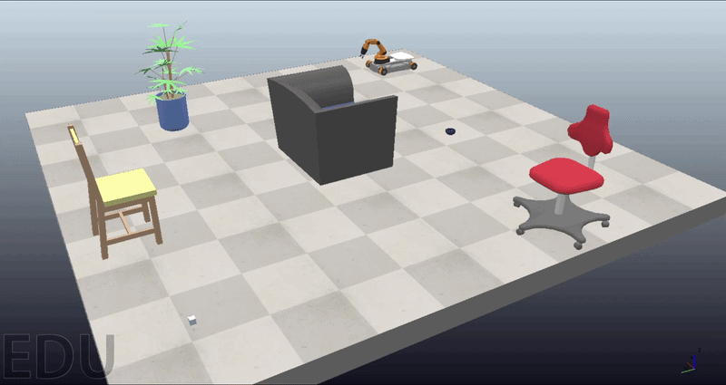

# PRM-RL Mobile Manipulation in CoppeliaSim

Hybrid classical planning and reinforcement learning pipeline for a simulated KUKA youBot mobile manipulator. The system combines PRM-based global navigation, path-frame feedback tracking, and SAC-based residual grasp correction for a complete pick-carry-place task.



## Project Overview

Mobile manipulation in cluttered environments requires solving several coupled problems:

1. Collision-aware navigation.
2. Path tracking.
3. Docking near the object.
4. Local grasp alignment.
5. Object lifting.
6. Transport to a drop region.
7. Object placement.

This project uses a modular hybrid architecture:

```text
PRM global planner
        ↓
Path-frame base controller
        ↓
Nominal pre-grasp pose
        ↓
SAC residual grasp correction
        ↓
Scripted close and lift
        ↓
PRM-based transport
        ↓
Object placement
```

The robot first plans and tracks a collision-free path to a docking pose near the cube. Then, the arm moves to a nominal pre-grasp configuration. A learned SAC policy applies small residual corrections to the arm joints to compensate for object-position uncertainty. After correction, the gripper closes, the cube is lifted, and the robot carries it to the target drop region.

---

## Results

The learned grasp-correction policy achieved:

- **96% success** over 100 trials on the full object-offset range.
- **94% success** over 100 trials on the edge-case offset range `[0.030, 0.035]` m.

The final integrated system demonstrates:

- PRM-based navigation through obstacles.
- Smooth path tracking using a tuned controller.
- Learned local correction before grasping.
- Successful cube lifting.
- Transport of the object to a final drop region.
- End-to-end pick-carry-place execution in simulation.

---

## Technical Highlights

- PRM planning through CoppeliaSim OMPL.
- 3D collision-aware validation for planar base planning.
- Densified PRM paths for smoother tracking.
- Path-frame tracking with:
  - closest-path projection,
  - preview point,
  - along-track feedback,
  - cross-track feedback,
  - yaw alignment,
  - heading gating,
  - wheel-command smoothing.
- Mecanum wheel mixer for `/youBot_ref`.
- SAC residual policy for local grasp correction.
- Observation design based on nominal successful cube-to-gripper geometry.
- Dense reward based on local alignment improvement and partial lift.
- Integrated classical-learning mobile manipulation pipeline.

---

## Repository Structure

```text
prm-rl-mobile-manipulation/
│
├── README.md
├── LICENSE
├── requirements.txt
├── .gitignore
│
├── scripts/
│   ├── run_integrated_pick_place.py
│   ├── run_prm_tracking_demo.py
│   ├── tune_base_controller.py
│   └── train_sac_grasp_correction.py
│
├── models/
│   └── README.md
│
├── scenes/
├── youbot_base_controller_tuning.ttt
├── youbot_sac_grasp_training.ttt
└── youbot_integrated_pick_place_demo.ttt
│
├── media/
    ├── demo_short.gif
    └──  pickup_scene.png

```

---

## Main Scripts

### Integrated pick-carry-place demo

```text
scripts/run_integrated_pick_place.py
```

Runs the complete pipeline:

1. Navigate from the start pose to the pickup region.
2. Dock near the cube.
3. Execute the learned SAC residual correction.
4. Close the gripper and lift the cube.
5. Plan and track a path to the drop region.
6. Release the object.

This is the main script to use for demonstrations.

---

### PRM tracking demo

```text
scripts/run_prm_tracking_demo.py
```

Runs the PRM planning and path-frame tracking part of the project without the learned grasp-correction module.

Use this script to showcase the classical navigation backbone.

---

### Base-controller tuning

```text
scripts/tune_base_controller.py
```

Tunes the path-frame controller on synthetic trajectory families, including:

- Rounded L-turns.
- Mirrored turns.
- Double lane changes.
- Slalom-like paths.
- Open arcs.
- Hairpin-like paths.

This script was used to select controller gains before integrating the full pick-carry-place task.

---

### SAC grasp-correction training

```text
scripts/train_sac_grasp_correction.py
```

Trains the local residual grasp-correction policy using Soft Actor-Critic.

The policy observes the error relative to a nominal successful cube-to-gripper geometry and outputs small residual corrections to the first five arm joints.

---

## Installation

Install the Python dependencies with:

```bash
pip install -r requirements.txt
```

Required external software:

- CoppeliaSim Edu
- CoppeliaSim ZeroMQ Remote API
- Python 3.10+
- Stable-Baselines3
- Gymnasium

---

## Running the Integrated Demo

1. Open the CoppeliaSim scene.
2. Stop the simulation.
3. Make sure the scene object paths match the script paths, especially:
   - `/youBot`
   - `/youBot_ref`
   - `/Cube`
   - `/Floor`
   - `/youBot/PlanningProxy`, if using the planning proxy
4. Make sure the trained SAC model is available in the `models/` folder.
5. Run:

```bash
python scripts/run_integrated_pick_place.py
```

---

## Training the SAC Grasp-Correction Policy

Example training command:

```bash
python scripts/train_sac_grasp_correction.py --mode train \
  --timesteps 10000 \
  --rand-min 0.000 \
  --rand-max 0.008 \
  --correction-steps 12 \
  --action-repeat 3 \
  --model-path models/sac_youbot_grasp_v5.zip \
  --checkpoint-freq 10000 \
  --save-replay-buffer \
  --progress-bar
```

Example resume command:

```bash
python scripts/train_sac_grasp_correction.py --mode train --resume \
  --timesteps 10000 \
  --rand-min 0.000 \
  --rand-max 0.008 \
  --correction-steps 12 \
  --action-repeat 3 \
  --model-path models/sac_youbot_grasp_v5.zip \
  --checkpoint-freq 10000 \
  --save-replay-buffer \
  --progress-bar
```

---

## Path-Frame Base Controller

The mobile base tracks the PRM-generated path using a path-frame feedforward plus feedback controller.

The controller uses:

- The closest projection of the robot onto the path.
- A preview point ahead of the current projection.
- Along-track error.
- Cross-track error.
- Yaw error relative to the path tangent.
- Heading-based velocity gating.
- Wheel-command smoothing.

The controller converts world-frame desired motion into the body frame using `/youBot_ref`.

The verified `/youBot_ref` convention is:

```text
+x / red   = right
+y / green = forward
+z / blue  = up
```

For wheel order:

```text
[front-left, rear-left, rear-right, front-right]
```

the verified mecanum mixer is:

```text
forward  -> [-1, -1, -1, -1]
right    -> [-1, +1, -1, +1]
yaw CCW  -> [+1, +1, -1, -1]
```

---

## Learned Residual Grasp Correction

The SAC policy is used only for local correction near the object.

The policy does not learn the entire task from scratch. Instead, it starts from a manually verified nominal pre-grasp pose and learns to compensate for randomized object offsets.

The action is a five-dimensional continuous vector applied to the first five arm joints. The gripper remains open during correction. After the correction phase, a scripted close-and-lift sequence is executed.

The final formulation uses:

- Error relative to the nominal successful grasp geometry.
- Dense reward for nominal-geometry alignment.
- Reward for improvement in planar alignment.
- Partial-lift reward so near-successes are not treated the same as complete failures.
- Curriculum over object-position offsets.

---


## Limitations and Future Work

Current limitations:

- The system is demonstrated in simulation.
- The learned policy is trained for local object offsets around a nominal grasp configuration.
- The pipeline depends on correct scene object names and CoppeliaSim setup.
- The grasping stage uses a hybrid learned correction plus scripted close/lift macro.

Future work:

- Test with more object shapes and sizes.
- Add visual perception instead of using simulator object states.
- Train policies for larger pose uncertainty.
- Integrate arm motion planning for more general pick-and-place tasks.
- Add sim-to-real transfer through domain randomization or system identification.
- Compare SAC with PPO or other reinforcement learning methods.
- Add safety filters or constraint-aware learning for deployment.

---


---

## Author

**Jose Daniel Hoyos**  
Ph.D. Candidate, Aeronautics and Astronautics  
Purdue University

---

## License

This project is released under the MIT License. See `LICENSE` for details.

